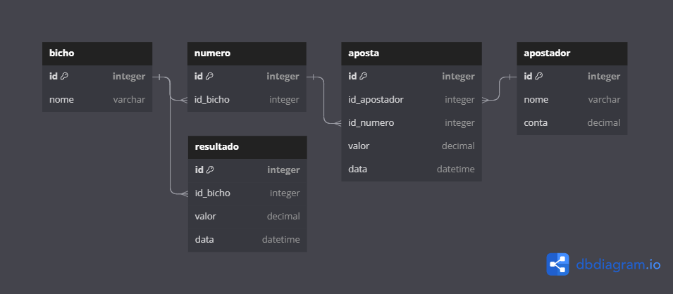

# bicho.bet

Projeto que simula o Jogo do Bicho.

### Modelo Físico:

    

Utilizado [dbdiagram](https://dbdiagram.io/), confira o nosso [Modelo Físico](https://dbdiagram.io/d/64cd327102bd1c4a5e43aa7a).

### Tecnologias:

- React.js;
- Java;
- Tailwind e DaisyUI;
- PostgreSQL.

### Colaboradores:

- [@higorgoulart](https://github.com/higorgoulart)
- 